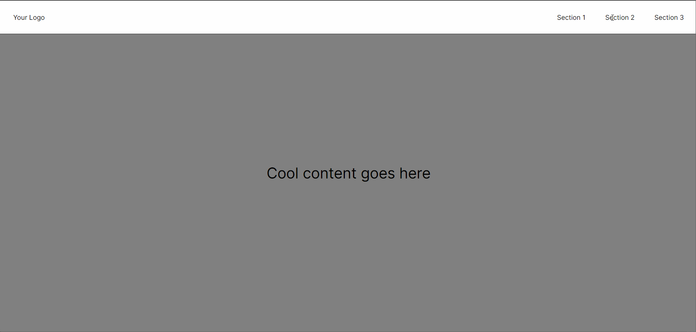

<!-- PROJECT LOGO -->
<br />
<div align="center">
 <h2 align="center">Next-Smooth-Scroll with chakra-UI, Storybook, react-scroll (TypeScript) </h2>
  <a href="https://github.com/aravindasiva/next-smooth-scroll-template">
    
  </a>

  <h3 align="center">Next-Smooth-Scroll </h3>

  <p align="center">
    An awesome template to jumpstart your projects!
    <br />
    <br />
    <br />
    <a href="https://next-smooth-scroll-template.vercel.app/">View Demo</a>
    ·
    <a href="https://github.com/aravindasiva/next-smooth-scroll-template/issues">Report Bug</a>
    ·
    <a href="https://github.com/aravindasiva/next-smooth-scroll-template/issues">Request Feature</a>
  </p>
</div>


<br/>
<br/>

<br />
<div align="center">
  <a href="https://github.com/aravindasiva/next-smooth-scroll-template">
    
  </a>
    <br />
    <br />
    <br />
    <a href="https://next-smooth-scroll-template.vercel.app/">View Demo</a>

  <h3 align="center">Next-Smooth-Scroll </h3>
</div>

<br/>
<br/>

# Built With


* [Next.js](https://nextjs.org/)
* [Chakra-UI](https://chakra-ui.com/docs/getting-started)
* [Storybook](https://storybook.js.org/docs/react/get-started/introduction)
* [react-scroll](https://yarnpkg.com/package/react-scroll)

## Getting Started

First, run the development server:

```bash
yarn #to install the dependencies
# and
yarn dev
```

Open [http://localhost:3000](http://localhost:3000) with your browser to see the result.

## Authors

Contributors names and contact info

Author: Aravind Cva <br/>
[LinkedIn](https://www.linkedin.com/in/aravindasiva/)
